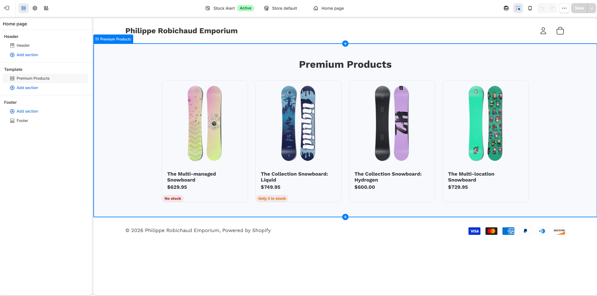
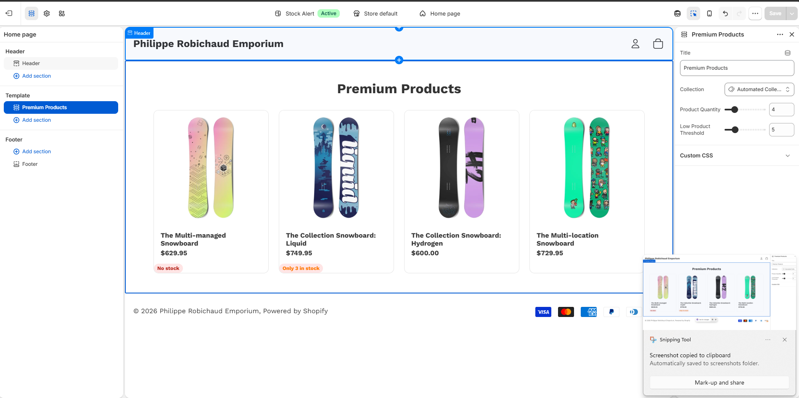
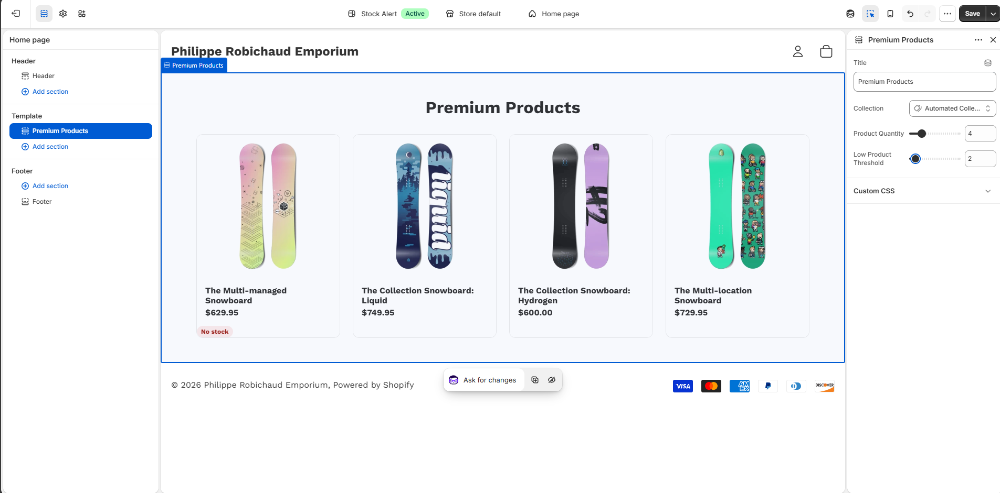
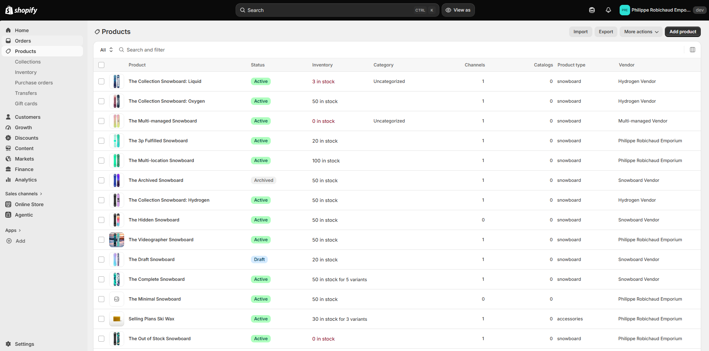

# Stock Alert – Liquid Theme and Shopify App

## Why this project

A personal project built to learn Shopify, reusing the same stock-update logic I had already implemented from messages in a previous project (on Azure), reproduced here with Shopify's own tools.

## Features

**Done – Theme (Liquid):** a "Premium Products" section with an "Only X in stock" badge when inventory is at or below a threshold configurable in the theme editor, and "No stock" at 0.

**In progress – Admin app:** will list low-stock products through the Admin GraphQL API, store the threshold, and log product updates received via webhook (`products/update`).

## Screenshots

The store is a private development store, so here is what it looks like.

**Premium Products section on the home page:** the "No stock" badge (0 units) and the "Only 3 in stock" badge (3 units, threshold of 5).



**Configurable threshold in the theme editor:** the same product with 3 units in stock, before and after changing "Low Product Threshold".

| Threshold 5: stock is below it, badge shown | Threshold 2: stock is above it, no badge |
|---|---|
|  |  |

**Inventory in the Shopify admin:** the badges come from real inventory data (`Liquid`: 3 in stock, `Multi-managed`: 0 in stock).



## Technologies

Liquid · Shopify CLI · Skeleton theme · Theme Check

Planned for the app: React Router 7 · TypeScript · Polaris · Admin GraphQL API · Webhooks · Prisma

## Running locally

```powershell
cd shopify-stock-alert/theme
shopify theme dev --store <your-store-name>
```
